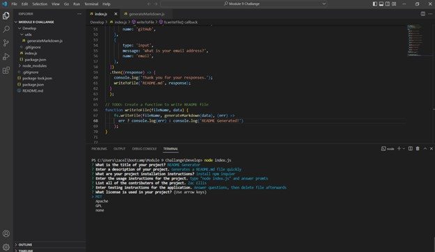

# README.md-Generator---UNC-M9---Zac-Ellis

## Table of contents
1.) [Description](#description)
2.) [Installation Instructions](#install)
3.) [Usage](#usage)
4.) [Contributers](#contributers)
5.) [Testing Instructions](#testing)
6.) [Contact Information](#contact)
7.) [Screen Shots](#screenShots)

## Description
Generates a Professional README file given user inputs to streamline the development process. 

## Installation Instructions
Install npm packages using "npm i inquier@8.2.4"

## Usage
Type "node.index.js" into the terminal to run the application. 
Answer prompted questions and README.md will be generated in the development folder. 

## Contributers
Zac Ellis

## Testing Instructions
Run application and answer prompts. 
Delete created README.md after verifiying it worked. 

## Contact Information
GitHub: zellis117 , Email: zacellis117@gmail.com

## Screen Shots

